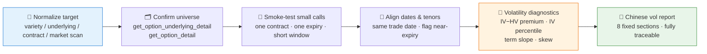

# 📈 Options Vol Analyst Skill

[简体中文](README.md) | **English**

> Is this option's volatility rich or cheap? — Option-chain snapshots, implied vs historical volatility, IV percentiles, term structure, skew/smile, and volatility premium, all in one traceable Chinese volatility diagnosis report.

Creator / maintainer: [`abgyjaguo`](https://github.com/abgyjaguo)

<p align="center">
  
  
  
  
  
  
</p>

---

## 📖 What is this

`options-vol-analyst` is an **Agent Skill**: give it an options variety, an underlying, or a specific contract, and it builds a traceable Pandadata data plan and produces a Chinese volatility analysis report — focused on **diagnosing the volatility environment**, not on order instructions.

Its core discipline is **verify data first, compute second, interpret last**:

- option symbols, underlying codes, exchanges, fields, and volatility windows are confirmed from Pandadata metadata — never invented;
- IV/HV units are normalized first (is it `0.24` or `24`?) — sources are converted to percent before mixing, with the conversion stated;
- contracts with **fewer than 7 calendar days to expiry** are flagged as near-expiry noise rather than blended into the normal term structure.

> All data contracts come from the sibling skill [`pandadata-api`](https://github.com/quantskills/skill-pandadata-api): method docs are inspected before any real call.

---

## ⚡ Analysis Pipeline



---

## 🗂️ Method Map

| Need | Primary methods |
|---|---|
| Underlying / options universe | `get_option_underlying_detail` · `get_option_detail` |
| Option-chain latest or historical snapshot | `get_option_daily` |
| Implied volatility time series / cross section | `get_option_implied_volatility` |
| Underlying historical volatility | `get_option_underlying_volatility` |
| Underlying close / return confirmation | `get_index_daily` · `get_stock_daily` · `get_future_daily` (by underlying type) |

---

## 🧮 Five Analysis Modes × Core Calculations

| Mode | Output |
|---|---|
| ⚡ **Quick snapshot** | Latest chain breadth, active expiries, ATM area, headline IV level, IV−HV premium, one-line caveats |
| 📊 **IV percentile** | Current IV vs its own history, with sample window, percentile method, excluded stale/illiquid samples, latest data date |
| 📅 **Term structure** | Grouped by expiry × comparable moneyness; is front-month IV rich or cheap vs back months |
| 🙂 **Skew/smile** | Put-side vs call-side IV by strike or delta proxy within one expiry, without over-reading illiquid wings |
| 📋 **Full report** | All of the above + tables, optional charts, method appendix, research disclaimer |

Core formulas (stated briefly in formal reports):

- **Days to expiry** = `expiry_date − trade_date` in calendar days; `< 7` flagged as near-expiry noise;
- **IV−HV premium** = `IV − HV` in volatility points after unit normalization;
- **IV/HV ratio** = computed only when HV > 0 over a stated window;
- **IV percentile** = percentile rank of current IV in the historical sample after removing nulls, stale rows, and no-trade observations (252 trading days by default; 60/120 days for short-history contracts, labeled);
- **Term-structure slope** = back-month ATM IV − front-month ATM IV at comparable moneyness;
- **Skew proxy** = put-side IV − call-side IV at comparable distance from ATM, or low-strike IV − high-strike IV when type pairing is unavailable.

### Liquidity & Quality Filters

- prefer contracts with nonzero volume or open interest when selecting representative strikes;
- treat deep OTM wings, zero-volume rows, stale last prices, and near-expiry contracts as lower-confidence evidence;
- never mix expiries when drawing a smile unless explicitly labeled as a cross-expiry comparison;
- empty results are not automatically API failures — check date availability, symbol format, listing status, market holidays, and credentials first.

---

## 🚀 Quick Start

### 1️⃣ Install (together with pandadata-api)

```bash
# Claude Code (global)
cp -r skill-pandadata-api       ~/.claude/skills/pandadata-api
cp -r skill-options-vol-analyst ~/.claude/skills/options-vol-analyst

# Codex (global, Agent Skills standard directory recommended)
mkdir -p ~/.agents/skills
cp -r skill-pandadata-api       ~/.agents/skills/pandadata-api
cp -r skill-options-vol-analyst ~/.agents/skills/options-vol-analyst

# Cursor (project level)
mkdir -p .cursor/skills
cp -r skill-pandadata-api       .cursor/skills/pandadata-api
cp -r skill-options-vol-analyst .cursor/skills/options-vol-analyst
```

### 2️⃣ Ask in natural language

```text
分析一下50ETF期权的波动率环境
当前IV处于历史什么分位？和历史波动率比贵不贵？
看看这个品种的期权期限结构和偏度
给我一份完整的期权波动率分析报告
```

### 3️⃣ Full report structure (fixed 8 sections)

```
Conclusion summary → Underlying & contract scope → Option-chain snapshot → IV vs HV
→ Term structure → Skew/smile → Data notes → Research conclusion
```

Chain evidence columns: `expiry | days to expiry | strike/moneyness | call IV | put IV | volume | open interest | IV−HV premium | notes`.

---

## 📦 Directory Layout

```
options-vol-analyst/
├── SKILL.md                       # Skill entry: core rules, workflow, method map, analysis modes, output standards
├── references/
│   └── analysis-playbook.md       # 📒 Data plans, default windows, unit checks, formulas, liquidity filters, report structure
└── agents/
    ├── openai.yaml                # OpenAI/Codex adapter
    ├── cursor-rule.mdc            # Cursor project-rule adapter
    └── portable-loader.md         # Generic loader for agents without native skill discovery
```

### Cross-Agent Use

| Runtime | How |
|---|---|
| Claude Code / Codex / Hermes / OpenClaw | Copy the full folder into their skill roots and load directly (`$options-vol-analyst`) |
| Cursor | Use `agents/cursor-rule.mdc` as project rule; keep the folder under `.cursor/skills/options-vol-analyst` |
| Other agents | Paste `agents/portable-loader.md` as the loader prompt |

> Keep `SKILL.md`, `agents/`, and `references/` together when installing — full reports depend on the reference playbook.

---

## 📐 Core Constraints

| Constraint | Description |
|---|---|
| 🧾 Contract first | Every real call and contract check goes through `pandadata-api`; method docs before code |
| 🚫 No invented identifiers | Option symbols, underlying codes, exchanges, fields, windows, trade dates all confirmed from Pandadata metadata |
| 📏 Unit normalization | IV/HV units (decimal vs percent) unified before calculation, conversion stated |
| 📅 Same-date alignment | Chain rows, IV, underlying close, and HV compared on the same trading date; near-expiry contracts flagged |
| ⚖️ Three-layer separation | Data facts, derived metrics, and interpretation labeled separately; formulas and windows stated |
| 🗣️ Diagnose, don't trade | Cautious wording ("indicates", "may suggest", "needs verification", "liquidity-constrained"); strategy execution handed off to strategy skills |

---

## ⚠️ Disclaimer

Reports are generated from public data and rule-based analysis, for research reference only. Nothing here constitutes investment advice.

## 📄 License

This project is released under the GNU General Public License v3.0, SPDX identifier `GPL-3.0-only`. See [LICENSE](LICENSE) for the full text.

## 🐼 PandaAI / QUANTSKILLS Community

<div align="center">
  
  <br>
  <sub>Scan the QR code to join the PandaAI community for QUANTSKILLS skills, agent workflows, and quantitative research practice.</sub>
</div>
